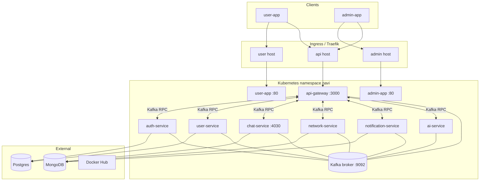

# Navi

Navi is a microservices social platform: NestJS backend, React frontends (user + admin), Kafka for inter-service messaging, and optional deployment to K3s via Helm with GitHub Actions CI/CD.

---

## Table of contents

- [Architecture overview](#architecture-overview)
- [Repository layout](#repository-layout)
- [Backend](#backend)
- [Frontend](#frontend)
- [Kafka broker](#kafka-broker)
- [Data stores](#data-stores)
- [Local development](#local-development)
- [Kubernetes & Helm](#kubernetes--helm)
- [CI/CD](#cicd)
- [GitHub Actions secrets](#github-actions-secrets)
- [Operations](#operations)

---

## Architecture overview

Clients reach three public hostnames (via Traefik Ingress on K3s, or Docker Compose ports locally):

| Host | Service | Purpose |
|------|---------|---------|
| `api.example.com` | **api-gateway** | REST `/api/*`, WebSockets, OAuth callbacks, VideoSDK call tokens |
| `app.example.com` | **user-app** | User SPA (feed, chat, calls, profile) |
| `admin.example.com` | **admin-app** | Admin SPA (moderation, users, reports) |

The **api-gateway** is the only HTTP entry point for backend logic. It forwards work to domain microservices over **Kafka** request/reply. Real-time features (chat typing, notifications, calls) use **Socket.IO** on the gateway.



**Production vs local:** Docker Compose runs Postgres, Mongo, and Kafka in-cluster. On K3s, **Postgres and Mongo are external** (connection URLs in secrets); only **Kafka runs inside the cluster**.

---

## Repository layout

```
navi02/
├── backend/                 # NestJS monorepo (7 microservices)
│   ├── apps/
│   ├── docker/              # db-init, entrypoints, postgres init SQL
│   └── Dockerfile           # Multi-target builds per service
├── frontend/
│   ├── user/                # User React SPA (Vite)
│   ├── admin/               # Admin React SPA (Vite)
│   └── nginx/spa.conf       # Shared nginx config for production frontends
├── helm/navi/               # Helm chart for K3s
├── .github/workflows/
│   ├── ci.yml               # Test + build/push images on push to main
│   └── cd.yaml              # Manual deploy to cluster
└── docker-compose.yml       # Full local stack
```

---

## Backend

NestJS monorepo under `backend/`. Each app is built as a separate Docker image (`navi-<service>`).

### Microservices

| Service | Port | Database | Role |
|---------|------|----------|------|
| **api-gateway** | 3000 | — | HTTP/WebSocket edge, JWT validation, routes to Kafka |
| **auth-service** | — | Postgres `auth_db` | Sign up/in, OTP, OAuth users, admin accounts, AI config |
| **user-service** | — | Postgres `user_db` | Profiles, follow graph, Cloudinary uploads |
| **chat-service** | 4030 | Mongo `chat_db` | Conversations, messages, groups |
| **network-service** | — | Mongo `network_db` | Posts, comments, likes, reports, feed |
| **notification-service** | — | Mongo `notification_db` | In-app notifications, realtime fan-out |
| **ai-service** | — | — | OpenAI content moderation |

### Communication pattern

- **HTTP:** Browsers → `api-gateway` only (`/api` global prefix).
- **Kafka:** Gateway and services use NestJS `ClientKafka` / `@MessagePattern` (e.g. `auth.signin`, `post.create`, `chat.send_message`).
- **WebSockets:** Socket.IO on gateway for chat events, notifications, and call signaling (`call_user`, `incoming_call`, `call_ended`).

### Key gateway modules

- **Auth** — cookies + JWT; Google/GitHub OAuth (callbacks excluded from `/api` prefix).
- **Call** — VideoSDK room/token creation.
- **Chat / Network / User / Notification / Admin** — thin HTTP controllers delegating to Kafka.

### Build

```bash
cd backend
npm ci
npm test
docker build --target api-gateway -t navi-api-gateway .
```

All services share `backend/Dockerfile` with `--target <service>`.

### Database init

`backend/docker/Dockerfile.db-init` runs `db-push-all.sh`:

- Prisma `db push` for **auth** and **user** (Postgres).
- Optional admin seed (`ADMIN_SEED_EMAIL` / `ADMIN_SEED_PASSWORD`).

Mongo schemas are managed by Mongoose in each service at runtime.

---

## Frontend

Two independent Vite + React SPAs, served by nginx in production.

### User app (`frontend/user`)

- **Auth:** register, OTP, login, OAuth, onboarding.
- **Social:** home feed, posts, comments, discover, notifications.
- **Chat:** DMs and groups, media, share post to chat.
- **Calls:** VideoSDK audio/video (1:1 and group), incoming banner, mini call bar, navigate away without dropping call.

Runtime API URL: baked at CI build (`VITE_*`) **and** overridden in K8s via `runtime-config.js` ConfigMap (Helm).

### Admin app (`frontend/admin`)

- Admin login (Kafka `auth.admin_signin`).
- Dashboard, pending/reported posts, users, admins, reports, AI moderation config.

### Build

```bash
cd frontend/user && npm ci && npm run build
cd frontend/admin && npm ci && npm run build
```

Docker images: `navi-user-app`, `navi-admin-app`.

---

## Kafka broker

Single-node **KRaft** broker (`apache/kafka:latest`) — no Zookeeper.

### Docker Compose

- Listeners: `PLAINTEXT://broker:9092` (internal), `PLAINTEXT_HOST://localhost:9094` (host).
- Apps use `KAFKA_BROKERS=broker:9092`.

### Kubernetes

- One `broker` Deployment (Recreate strategy), ClusterIP Service on port **9092**.
- **Advertised listeners** are set at container start from `BROKER_SERVICE_HOST` (service link ClusterIP) so clients receive reachable metadata.
- **`kafka.colocateApps: true`** — pod affinity pins Kafka-consuming apps on the same node as the broker (helps multi-node K3s / AWS networking).
- Init container `wait-kafka` blocks app start until port 9092 is open.
- Apps set `KAFKA_BROKERS=${BROKER_SERVICE_HOST}:9092` via shell wrapper in the entrypoint.

Topics are auto-created (`KAFKA_AUTO_CREATE_TOPICS_ENABLE=true`). NestJS Kafka consumers use per-service `groupId`s.

---

## Data stores

| Store | Services | Notes |
|-------|----------|-------|
| **Postgres** | auth, user | Prisma; external in prod |
| **MongoDB** | chat, network, notification | Mongoose; external in prod |

Helm injects URLs via Secret `navi-secrets` keys: `AUTH_DATABASE_URL`, `USER_DATABASE_URL`, `CHAT_DATABASE_URL`, `NETWORK_DATABASE_URL`, `NOTIFICATION_DATABASE_URL`.

---

## Local development

### Quick start

```bash
cp .env.docker.example .env   # if present; set JWT_* and optional OAuth/Cloudinary keys
docker compose up --build
```

| URL | Service |
|-----|---------|
| http://localhost:8080 | User app |
| http://localhost:8081 | Admin app |
| http://localhost:3000/api | API |
| localhost:9094 | Kafka (from host) |

Postgres, Mongo, Kafka, and `db-init` all run in Compose. See `docker-compose.yml` for service env vars.

### Backend only (without Docker)

Run Kafka/DB locally or point env vars at Compose services, then from `backend/`:

```bash
npm run start:dev api-gateway
# + other services in separate terminals
```

---

## Kubernetes & Helm

Chart path: **`helm/navi/`**.

### What gets deployed

| Workload | Image | Notes |
|----------|-------|-------|
| broker | `apache/kafka:latest` | In-cluster only |
| api-gateway, 7 backends | `<registry>/navi-<service>:latest` | From CI |
| user-app, admin-app | `<registry>/navi-user-app`, `navi-admin-app` | nginx + SPA |
| navi-db-init | Job (hook) | First install only by default |
| navi-secrets, navi-config | Secret, ConfigMap | From CD |
| navi-frontend-runtime | ConfigMap | `runtime-config.js` for SPAs |
| navi | Ingress | Traefik, 3 hosts |

### Templates

- `deployment.yaml` — reusable loop over `.Values.services`
- `service.yaml` — ClusterIP per service with a port
- `ingress.yaml` — routes hosts to api-gateway / user-app / admin-app
- `secret.yaml`, `configmap.yaml`, `configmap-frontend-runtime.yaml`
- `job-db-init.yaml` — Helm hook `post-install` (optional `post-upgrade` via `dbInit.runOnUpgrade`)

### Values (`helm/navi/values.yaml`)

Important keys:

```yaml
namespace: navi
image:
  registry: dockerhub-user
  tag: latest
  pullPolicy: Always
deploy:
  stamp: "0"              # bumped by CD → forces rollout
dbInit:
  enabled: true
  runOnUpgrade: false     # do not re-push DB on every CD
kafka:
  colocateApps: true
ingress:
  className: traefik
  apiHost / userAppHost / adminAppHost
```

### Deploy overrides

CD generates `deploy-values.yaml` via `helm/navi/render-deploy-values.sh` (registry, secrets, ingress hosts, HTTPS frontend URLs, `COOKIE_SECURE`).

### Manual deploy

```bash
export DOCKERHUB_USERNAME=... JWT_ACCESS_SECRET=... API_HOST=api.example.com ...
sh helm/navi/render-deploy-values.sh > deploy-values.yaml

helm upgrade --install navi helm/navi \
  -f helm/navi/values.yaml \
  -f deploy-values.yaml \
  --namespace navi --create-namespace
```

### First-time schema + admin seed

Runs automatically on **`helm install`** when `dbInit.enabled: true`.

To run again after a schema change:

```bash
helm upgrade --install navi helm/navi ... --set dbInit.runOnUpgrade=true
```

Build/push db-init image first:

```bash
docker build -f backend/docker/Dockerfile.db-init -t $USER/navi-db-init:latest backend
docker push $USER/navi-db-init:latest
```

---

## CI/CD

### CI (`.github/workflows/ci.yml`)

**Trigger:** push to `main`.

| Job | Action |
|-----|--------|
| backend-test | `npm test` in `backend/` |
| frontend-user-test | Vitest in `frontend/user/` |
| build-backend | Matrix: 7 services → Docker Hub `navi-<service>:latest` + `sha-*` |
| validate-frontend-config | Requires HTTPS `VITE_*` or `API_HOST` |
| build-frontend | `navi-user-app`, `navi-admin-app` with Vite build args |

Images: `{DOCKERHUB_USERNAME}/navi-<name>:latest`.

### CD (`.github/workflows/cd.yaml`)

**Trigger:** manual (`workflow_dispatch`).

1. Load `KUBE_CONFIG` secret.
2. Render `deploy-values.yaml` from GitHub secrets.
3. `helm lint` + `helm upgrade --install`.
4. Rollout restart all Deployments (including broker) to pick up `:latest` images.
5. **Does not** re-run db-init on upgrade (`runOnUpgrade: false`).

Concurrency: one CD run per branch at a time.

---

## GitHub Actions secrets

### CI (minimum)

| Secret | Purpose |
|--------|---------|
| `DOCKERHUB_USERNAME` | Registry namespace |
| `DOCKERHUB_TOKEN` | Push access |
| `API_HOST` or `VITE_API_URL` + `VITE_WS_ORIGIN` | Frontend build URLs (HTTPS) |

Optional: `VITE_ENABLE_OAUTH`.

### CD (additional)

| Secret | Purpose |
|--------|---------|
| `KUBE_CONFIG` | Full kubeconfig for K3s |
| `K8S_NAMESPACE` | Default `navi` |
| `API_HOST`, `USER_APP_HOST`, `ADMIN_APP_HOST` | Ingress + runtime SPA config |
| `JWT_ACCESS_SECRET`, `JWT_RESET_SECRET` | Auth |
| `AUTH_DATABASE_URL`, `USER_DATABASE_URL` | Postgres |
| `CHAT_DATABASE_URL`, `NETWORK_DATABASE_URL`, `NOTIFICATION_DATABASE_URL` | Mongo |
| `FRONTEND_ORIGIN` | CORS (auto-derived from app hosts if omitted) |
| OAuth, Cloudinary, VideoSDK, OpenAI, SMTP | Optional integrations |
| `ADMIN_SEED_EMAIL`, `ADMIN_SEED_PASSWORD` | First-install admin seed |

Example production URLs:

```
API_HOST=api.example.com
USER_APP_HOST=app.example.com
ADMIN_APP_HOST=admin.example.com
VITE_API_URL=https://api.example.com/api
VITE_WS_ORIGIN=https://api.example.com
```

---

## Operations

### Check cluster health

```bash
kubectl get pods -n navi
kubectl logs -n navi deploy/api-gateway --tail=100
kubectl logs -n navi deploy/broker --tail=50
```

### Verify Kafka advertised listeners

```bash
kubectl exec -n navi deploy/broker -- sh -c \
  'tr "\0" "\n" < /proc/1/environ | grep KAFKA_ADVERTISED'
# Expect PLAINTEXT://10.x.x.x:9092 (ClusterIP), not a literal $(BROKER_SERVICE_HOST)
```

### Verify frontend runtime config

```bash
curl -s https://admin.example.com/runtime-config.js
```

### Common issues

| Symptom | Likely cause | Fix |
|---------|--------------|-----|
| Mixed content on admin login | SPA calling `http://` API | HTTPS in `VITE_*` / `runtime-config.js` |
| Kafka "does not host this topic-partition" | Wrong `advertised.listeners` | Redeploy broker chart; restart apps |
| `:latest` not updating on nodes | Cached image | CD sets `pullPolicy: Always` + `deploy.stamp` + rollout restart |
| DB reset every deploy | db-init on upgrade | Keep `dbInit.runOnUpgrade: false` |
| Init stuck on `wait-kafka` | Broker not ready / networking | Check broker pod; consider `colocateApps` |

### TLS

Ingress rules are HTTP. Terminate TLS at Cloudflare, AWS ALB, or Traefik with certificates; point DNS A records at the load balancer or K3s node IP.

---

## License

See repository license if applicable. Third-party services (VideoSDK, Cloudinary, OpenAI) require their own API keys.
